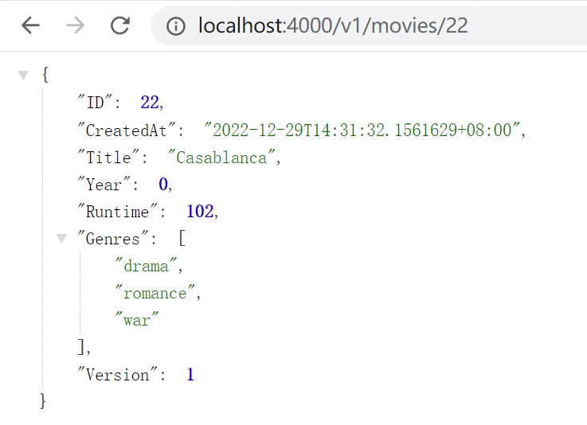
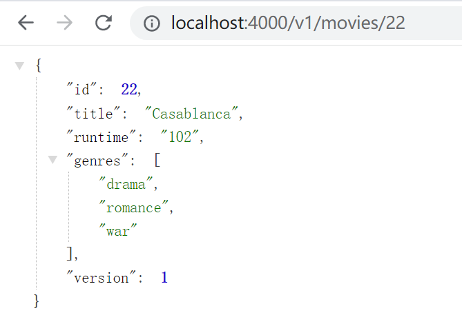
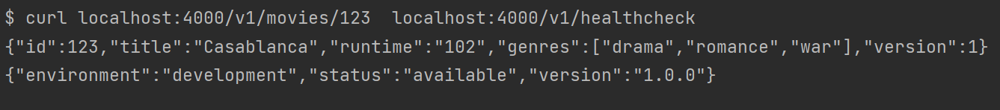
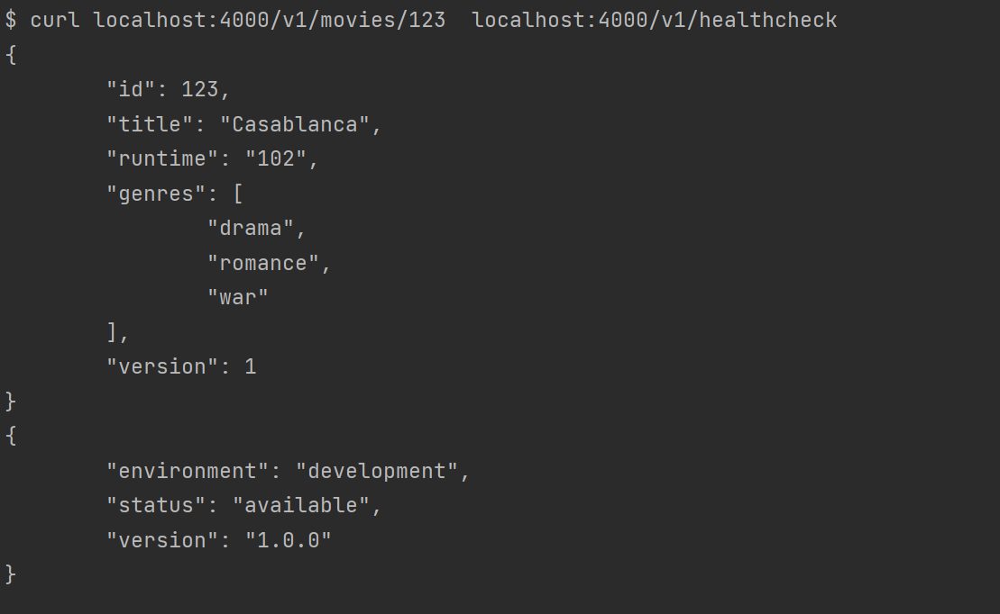
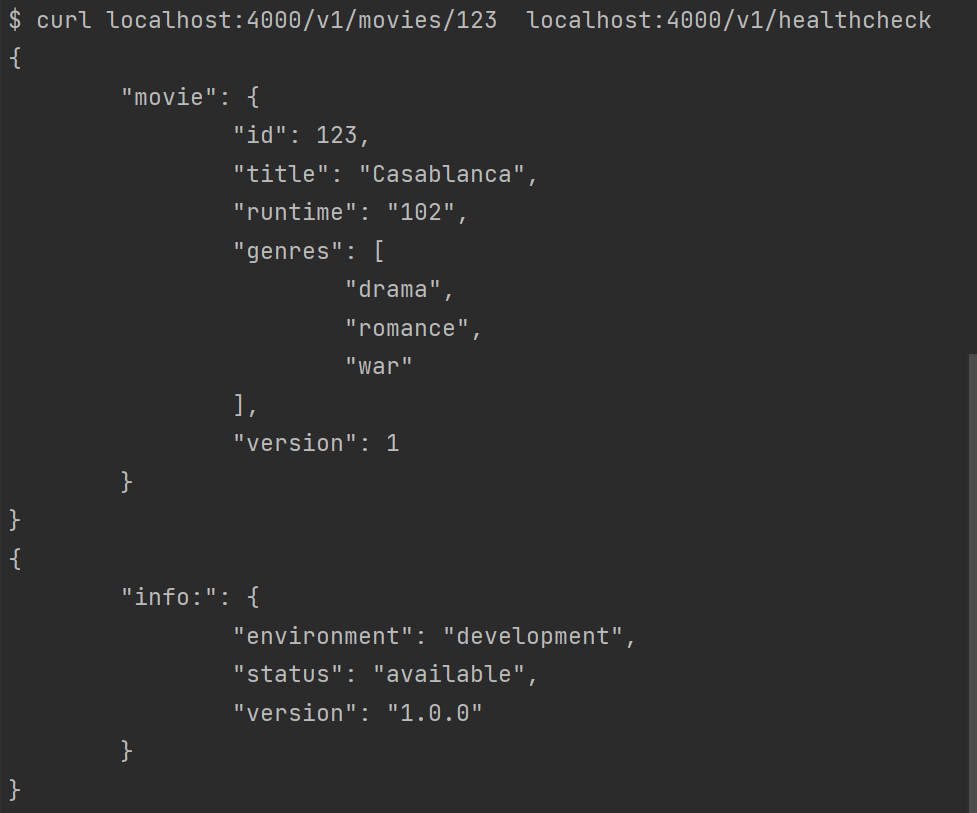
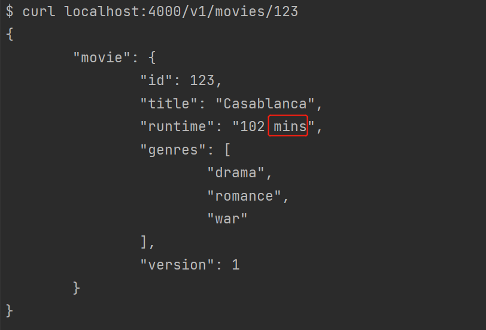

# golang格式化json数据
```
//这里的例子是将电影信息json格式化输出
type Movie struct {
	ID        int64     // ID
	CreatedAt time.Time // 电影记录创建时间
	Title     string    // 标题
	Year      int32     // 上映年代
	Runtime   int32     // 电影播放时长
	Genres    []string  // 电影主题，包括(romance, comedy, etc.)
	Version   int32     // 从1开始，每次更新时+1
}

//获取请求参数中的电影id，这是基于httprouter包实现的
func readIDParam(r *http.Request) (int64, error) {
	//解析请求参数，将查询的id转为int类型，因为可能后期数据量比较大，所以用int64类型
	params := httprouter.ParamsFromContext(r.Context())
	id, err := strconv.ParseInt(params.ByName("id"), 10, 64)
	if err != nil || id < 1 {
		//通过http.Error(w, err.Error(), http.StatusBadRequest)可以将这里生成的错误信息返回给客户端
		return 0, errors.New("invalid id parameter")
	}
	return id, nil
}

//将数据类型格式为json并输出的过程包装成一个函数，这个函数还接受状态码和响应头信息
func (app *application) writeJSON(w http.ResponseWriter, status int, data any, headers http.Header) error {
	js, err := json.Marshal(data)
	if err != nil {
		return err
	}
	//这里js是[]byte类型,可以直接append rune类型
	js = append(js, '\n')

	//可以稍后自定义一个响应头headers，然后直接将内容遍历写到响应头
	for key, value := range headers {
		w.Header()[key] = value
	}
	//内容可以自定义，默认是Content-Type: text/plain; charset=utf-8，返回json数据时一般设置为application/json
	w.Header().Set("Content-Type", "application/json")
	w.WriteHeader(status)
	w.Write(js)
	return nil
}

func (app *application) showMovieHandler(w http.ResponseWriter, r *http.Request) {
	id, err := readIDParam(r)
	if err != nil {
		//	解析不了，那么可能是请求的id并非数字,可能是请求参数有问题，BadRequest
		//粗糙便捷的方式：http.NotFound(w, r)
		http.Error(w, err.Error(), http.StatusBadRequest)
		return
	}
	movie := Movie{
		ID:        id,
		CreatedAt: time.Now(),
		Title:     "Casablanca",
		Runtime:   102,
		Genres:    []string{"drama", "romance", "war"},
		Version:   1,
	}
	err = app.writeJSON(w, 200, movie, nil)
	if err != nil {
		app.logger.Println(err)
		http.Error(w, "The server encountered a problem and could not process your request", http.StatusInternalServerError)
	}
}
```
请求响应的结果，每一项都和实例化的movie结构体的内容是一致的：   
   

给movie结构体的数据项贴上标签，这样可以自定义响应的数据项的key值,以更方便阅读的形式显示。     
```
type Movie struct {
	ID        int64     `json:"id"`
	CreatedAt time.Time `json:"created_at"`
	Title     string    `json:"title"`
	Year      int32     `json:"year"`
	Runtime   int32     `json:"runtime"`
	Genres    []string  `json:"genres"`
	Version   int32     `json:"version"`
}
```   
新的结果显示如下，每个数据项的key值都改变了：   
   

这样的结果还是有些问题，比如假设让"created_at"这个信息不显示，另外"year"没数据时也不显示，可以通过更给json标签来实现。   
```
type Movie struct {
	ID        int64     `json:"id"`
	CreatedAt time.Time `json:"-"` // 使用 - 直接不显示
	Title     string    `json:"title"`
	Year      int32     `json:"year,omitempty"`           // 增加 omitempty 空不显示
	Runtime   int32     `json:"runtime,omitempty,string"` // 增加 string 指定以string类型显示
	Genres    []string  `json:"genres,omitempty"`
	Version   int32     `json:"version"`
}
```
新的结果如下，不显示的`CreatedAt`和没有数据的`Year`都没有显示，而指定以string类型显示的`Runtime`含引号显示了,     
但这个string指定值只对于int、uint、float、bool类型的字段有效。   
   

现在通过浏览器插件显示的json格式响应还算比较容易阅读，但如果通过命令行请求，返回的数据可读性很差：   
    

可以使用`json.MarshalIndent`替换`json.Marshal`增加缩进，替换后新的显示如下，可读性增加了很多，不过这样会牺牲一些性能：    
   

可以将json数据包裹起来增加可读性达到如下显示效果：   
```
// 定义一个map类型的envelope，增加自定义的key值并将要表达的json数据作为value包装起来
type envelope map[string]interface{}

func (app *application) writeJSON(..., data envelope,...) error {
func (app *application) showMovieHandler(w http.ResponseWriter, r *http.Request) {
        ...
    // 将要表达的json数据作为value包在envelope中
	err = app.writeJSON(..., envelope{"movie": movie}, nil)
        ...
}
func (app *application) healthCheckHandler(w http.ResponseWriter, r *http.Request) {
        ...
    // 将要表达的json数据作为value包在envelope中
	err := app.writeJSON(..., envelope{"info:": data}, nil)
        ...
}
```   
    

除了以上增加tag和json数据包装这些方式，go语言还支持通过重写`MarshalJSON()`方法来自定义json处理方式。     
比方说，假设要把客户端响应的`"runtime": "102"`--->`"runtime": "102 mins"`,可以这样实现：   
```
//MarshalJson()是序列化过程的主要函数入口,可以通过重写这个函数自定义序列化时的行为
type Marshaler interface {
	MarshalJSON() ([]byte, error)
}

// 自定义数据类型Runtime，然后对这个类型重写MarshalJson方法，这样在对该类型序列化过程中将使用自定义的函数行为
type Runtime int32
func (r Runtime) MarshalJSON() ([]byte, error) {
	jsonValue := fmt.Sprintf("%d mins", r)
	// 需要使用双引号括起来以符合正确的json格式字符串
	quotedJsonValue := strconv.Quote(jsonValue)
	return []byte(quotedJsonValue), nil
}

//更改对应地方的数据类型
type Movie struct {
	ID        int64     `json:"id"`
	CreatedAt time.Time `json:"-"` // - 不显示
	Title     string    `json:"title"`
	Year      int32     `json:"year,omitempty"`           // 增加 omitempty 空不显示
	Runtime   Runtime   `json:"runtime,omitempty,string"` // 增加 string 指定以string类型显示
	Genres    []string  `json:"genres,omitempty"`
	Version   int32     `json:"version"`
}
```
    
 


